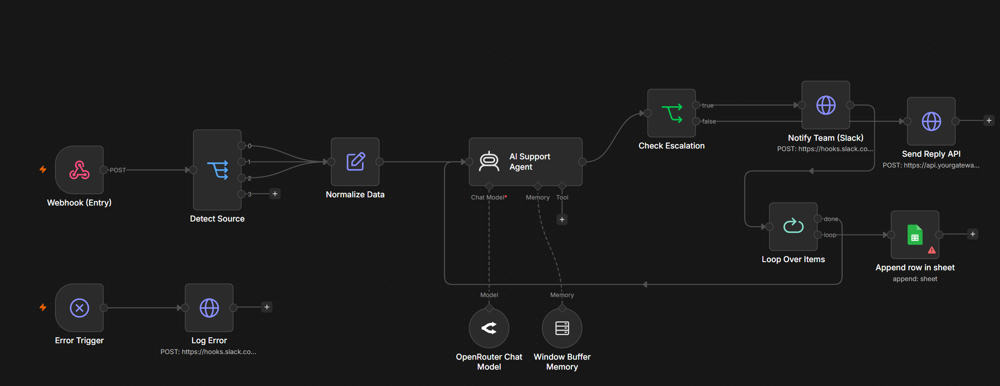

# Omnichannel AI Support Agent

An AI-powered customer support workflow built with n8n.

This workflow receives customer messages from multiple channels, processes them with an AI Agent, and automatically generates intelligent responses. It also supports human escalation, conversation memory, and logging.

---

## Features

- Multi-channel support
  - WhatsApp
  - Messenger
  - Instagram

- AI-powered responses using OpenRouter

- Conversation memory

- Human escalation

- Slack notifications

- Google Sheets logging

- Error handling workflow

---

## Tech Stack

- n8n
- OpenRouter
- OpenAI-compatible models
- Slack
- Google Sheets
- HTTP APIs

---

## Workflow Overview

Webhook
↓
Detect Source
↓
Normalize Data
↓
AI Support Agent
↓
Check Escalation
├── Human Handoff (Slack)
└── Send Reply API
↓
Google Sheets Logging

---

## Use Cases

- Customer Support
- AI Help Desk
- FAQ Automation
- Lead Qualification
- Business Automation

---

## Future Improvements

- RAG Knowledge Base
- CRM Integration
- Redis Memory
- Sentiment Analysis
- Analytics Dashboard
- Ticketing System

---

## Author

**Emad Alrobassi**

LinkedIn:
https://linkedin.com/in/emadalrobassi

GitHub:
https://github.com/imcrzma
